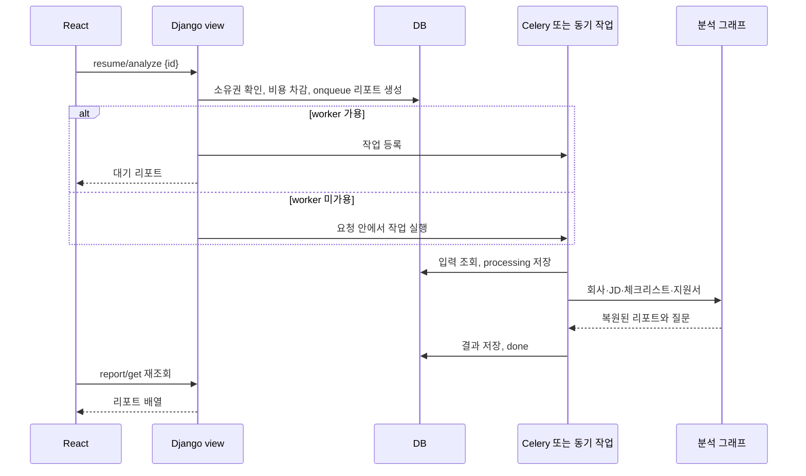

# 데이터 흐름

## 화면 데이터 조회

[main.tsx](../../frontend/src/main.tsx)가 Router·Query Provider를 구성합니다. 인증 후 [queryOptions](../../frontend/src/api/queryOptions.ts)가 계정 모드 또는 API Key 모드에 맞는 AppData를 읽습니다.

[dashboardSource](../../frontend/src/api/services/dashboardSource.ts)는 계정·회사·JD를 먼저 조회하고 JD별 지원서, 지원서별 리포트를 조합합니다. [appDataService](../../frontend/src/api/appDataService.ts)와 adapter가 화면 모델로 변환합니다. 단일 대시보드 API가 아니라 여러 요청을 합치는 구조이므로 JD·지원서 수가 늘면 요청 수도 증가합니다.

캐시 키는 인증 모드와 임의 `authSessionKey`로 분리합니다. 키 원문이나 키 fingerprint를 query key에 넣는 구조가 아닙니다. 리포트 또는 체크리스트가 `onqueue`/`processing`이면 3초 간격으로 재조회합니다.

## 지원서 분석

큐 등록 자체가 실패하면 리포트를 `fail`로 바꾸고 차감분을 환불합니다. 작업 실행 중 예외는 task의 실패 처리로 이어집니다. 모델에는 별도 `queued`·`refunded` 상태가 없으며, `Resume.status`도 없습니다. [view](../../backend/api/views/resume_endpoints.py)와 [task](../../backend/api/tasks.py)가 기준입니다.

## JD 체크리스트

`jd/analyze`는 권한과 현재 상태를 확인하고 `checklist_status`를 `onqueue`로 바꿉니다. task는 기존 항목 수와 `cnt`로 생성 수를 계산하고 회사·JD 및 검색 조건을 그래프에 전달합니다. 생성 문자열을 정리해 Checklist에 추가한 뒤 `done`으로 바꿉니다. `cnt`가 양수이면 기존 총개수와 별도로 요청 개수를 최대 10으로 제한합니다.

## 채팅과 공유

[채팅 view](../../backend/api/views/chat_endpoints.py)는 `chat` 배열을 검사하고 접근 가능한 JD 및 데이터 검색 함수를 그래프에 전달합니다. HR 데이터 검색과 Pinecone 매뉴얼 검색 결과를 합쳐 `{role:"agent", message}`로 응답합니다. 프론트는 `assistant`를 전송 시 `agent`로 변환합니다.

[공유 client](../../frontend/src/api/clients/chatClient.ts)는 키로 지원서를 확인하고 JD·리포트 목록을 조회한 뒤 리포트 JSON에서 질문을 추출합니다. 공유 화면의 요청 취소와 로컬 오류 처리는 [useSharedReportSession](../../frontend/src/hooks/useSharedReportSession.ts)이 담당합니다.
