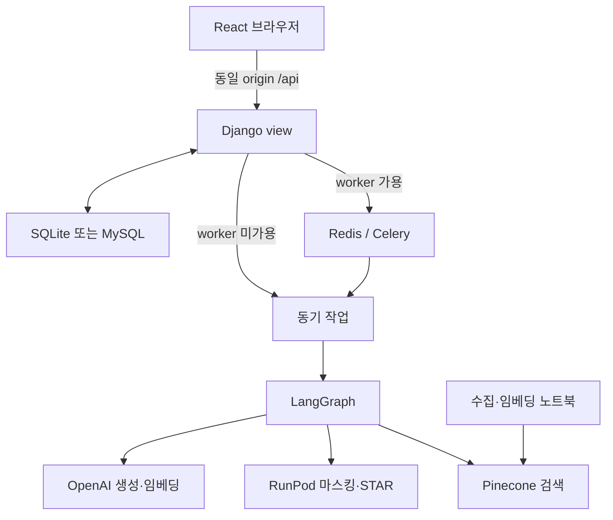

# 시스템 아키텍처

## 요청 계층

개발 중에는 [Vite](../../frontend/vite.config.ts)가 API를 프록시하고, 배포 구성에서는 [프론트 Nginx](../../.deploy/frontend.conf)가 백엔드 Nginx로 전달합니다. React Router의 직접 URL 접근은 정적 서버의 `index.html` fallback이 필요합니다.

프론트 데이터 경계는 `httpClient → clients → backendSchemas → adapters → page hooks`입니다. [HTTP 클라이언트](../../frontend/src/api/httpClient.ts)가 CSRF·쿠키·API Key·인증 만료를 처리하며 [Zod 스키마](../../frontend/src/api/backendSchemas.ts)가 응답을 검사합니다.

## 백엔드 계층

[Django URL](../../backend/api/urls.py)은 함수형 view로 연결됩니다. view는 소유권·입력 필드를 확인하고 ORM 모델의 `to_dict()`를 응답합니다. 별도 DRF serializer나 자동 OpenAPI 생성 구성은 없습니다.

[작업 모듈](../../backend/api/tasks.py)은 DB 입력 수집, 작업 상태 변경, 그래프 실행, 결과 저장과 실패 환불을 담당합니다. Celery 유무와 관계없이 동일한 작업 함수를 사용합니다. 지원서 분석 view 자체는 동기 함수이고 일반 채팅 view는 async 함수입니다.

## AI와 저장소 경계

[분석 그래프](../../backend/common/analysis_graph.py)는 마스킹·STAR·판정·질문·리포트 순서를 연결합니다. [채팅 그래프](../../backend/common/chat_graph.py)는 HR 데이터와 매뉴얼 검색 분기를 합칩니다. 관계형 DB의 업무 데이터와 Pinecone의 참고 조건·매뉴얼 데이터는 별도 저장소입니다.

`data-pipeline/`와 `llm/`의 노트북은 서비스 실행 시 자동 실행되지 않습니다. RunPod 모델도 웹 API 배포와 별도로 준비해야 합니다. 데이터와 모델 준비 절차는 [AI 문서](../07-ai-modeling/README.md), 운영 네트워크는 [배포](../09-deployment/deployment.md)에 있습니다.
