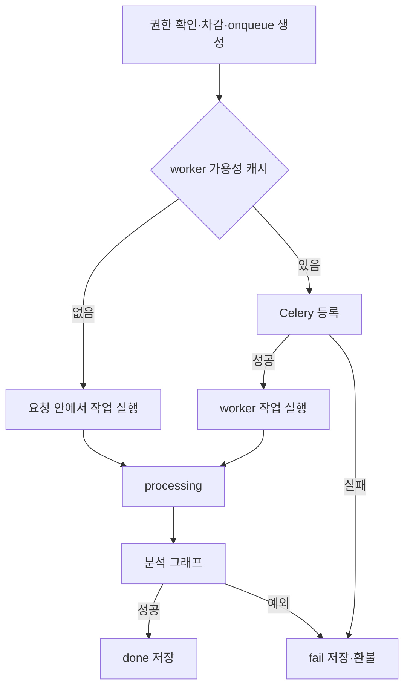

# 분석 작업과 저장

## 리포트 요청

[resume_analyze](../../backend/api/views/resume_endpoints.py)는 `{id}`로 지원서를 받고 소유권 또는 API Key 허용 범위를 확인합니다. 세션 계정의 `subscribe_expiration`이 미래이면 계정 비용을 차감하지 않습니다. 이 판단은 `subscribe` 플래그를 함께 검사하지 않습니다. 그 외에는 계정 또는 키에서 100 크레딧을 조건부 `F()` update로 차감합니다.

차감과 `AnalysisReport(status="onqueue")` 생성은 같은 transaction 안에서 이루어집니다. 현재 view에는 동일 지원서의 기존 처리 중 리포트 검사와 체크리스트 존재 검사가 없습니다.

## worker 분기

큐 등록 실패 응답은 `error:false`와 실패 상태 리포트일 수 있습니다. worker 미가용 시의 동기 실행과 큐 등록 실패를 혼동하지 않습니다. 가용성은 최초 ping 결과를 캐시합니다.

## 작업의 책임

[analyze_and_save_report](../../backend/api/tasks.py)는 DB transaction에서 리포트와 회사·JD·지원서·체크리스트를 조회하고 `processing`을 저장합니다. 외부 그래프 실행은 transaction 밖에서 수행한 뒤 다시 잠금을 잡아 결과를 기록합니다.

`_apply_analysis_result()`는 그래프의 `question` 배열을 `interview_question`으로 옮기고 분석 버전·등급·요약·역량·강점·우려·확인 포인트를 저장합니다. 완료 상태는 `done`이며 Resume에 별도 상태를 기록하지 않습니다.

## 실패와 환불

작업 예외에는 실패 상태를 기록하고 차감분을 돌려주는 경로가 있습니다. 이미 done/fail인 리포트의 일반 실패 처리에서는 상태 update 결과로 중복 환불을 줄입니다. 그러나 삭제된 리포트·중복 task·프로세스 강제 종료까지 포함한 정확히 한 번 처리나 자동 복구 보장은 없습니다.

처리 중 리포트는 수정·삭제 view에서 거부하지만 대기 상태에는 동일 제한이 없습니다. 수동 재시도 전 리포트·잔액·worker 로그를 함께 확인합니다.

## 체크리스트 작업

[jd_analyze](../../backend/api/views/job_description_endpoints.py)는 `onqueue`/`processing` 상태의 재요청을 거부합니다. 상태 확인과 변경 전체가 하나의 잠금으로 보호되는 것은 아니므로 동시 요청의 완전한 중복 방지를 보장하지 않습니다.

`cnt=0`은 기본 목표 10개에서 기존 항목 수를 뺀 수를 생성합니다. 양수 `cnt`는 최대 10개를 요청하며 기존 총개수를 10으로 제한하는 의미가 아닙니다. 생성 문자열을 저장하고 `checklist_status`를 `done` 또는 `fail`로 갱신합니다. 모델 내부 단계는 [AI 파이프라인](../07-ai-modeling/model-pipeline.md)에 있습니다.
