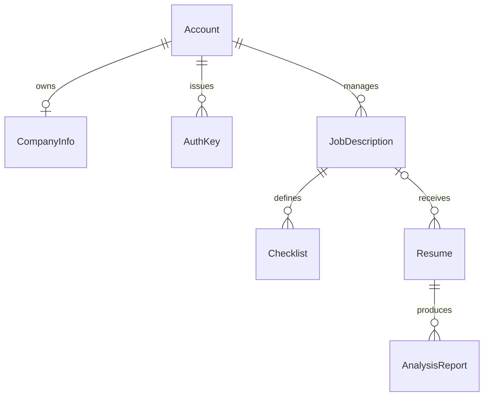

# 스키마와 ERD

관계형 모델의 기준은 [models.py](../../backend/api/models.py), 변경 이력은 [migrations](../../backend/api/migrations/)입니다. 로컬 SQLite와 원격 MySQL은 같은 Django 모델을 사용합니다.

회사 정보는 OneToOne이며 조회 과정에서 생성될 수 있으므로 계정 생성 즉시 반드시 한 행이 있다는 뜻은 아닙니다. Resume의 JD FK는 모델상 nullable이나 등록 API는 접근 가능한 JD를 요구합니다.

## 테이블과 주요 필드

| 모델 / 테이블 | 주요 필드 |
| --- | --- |
| Account / `users` | AbstractUser 필드, `name`, 확인 질문·답변, `credit`, `subscribe`, `subscribe_expiration`, `account_hash` |
| CompanyInfo / `company_info` | 계정 FK, `company_name`, `employee_count`, `team_composition`, `company_description`, `employ_style` |
| AuthKey / `auth_keys` | 계정 FK, `name`, `description`, `value`, `credit_limit`, `authorized_resume` |
| JobDescription / `job_descriptions` | 계정 FK, 직무·학력·전공·경력, 필요·우대 기술, 업무·채용 사유, 근무 유형, `status`, `checklist_status`, 시각 |
| Checklist / `checklists` | JD FK, `content` |
| Resume / `resumes` | JD FK, 이름·기술·학력·경력, `self_intoduction`, 자격·어학·수상·교육·활동, `reviewed`, 시각 |
| AnalysisReport / `analysis_reports` | 지원서 FK, 버전·평가·메모, 등급·요약, 체크리스트·역량, 동기·협업·강점·우려·질문, `status`, 생성 시각 |

`authorized_resume`는 FK 관계가 아니라 JSON ID 목록입니다. 이 배열의 의미·소유권은 view가 검사하며 DB가 참조 무결성을 강제하지 않습니다. 계정·JD·지원서의 FK 삭제는 CASCADE이므로 하위 데이터도 삭제됩니다.

## JSON 계약

지원서 `education_level`은 기본 `{}`, 나머지 기술·경력·자기소개 등은 기본 `[]`로 직렬화합니다. `self_intoduction`은 현재 필드의 실제 철자입니다.

면접 질문은 별도 테이블이 아닌 `AnalysisReport.interview_question`에 `{question, answer, purpose}` 배열로 저장합니다. `get_interview_question()`은 객체 항목만 골라 문자열 기본값을 정리합니다. 리포트의 `checklist`, `competency_analysis`, `strength`, `concern`, `check_point`도 JSON 필드입니다.

## 상태와 기본값

- JD `status`: `prepare`, `on_going`, `closed`
- JD `checklist_status`: `onqueue`, `processing`, `done`, `fail`; 기본값 `done`
- 리포트 `status`: `onqueue`, `processing`, `done`, `fail`; 기본값 `onqueue`
- 계정 `credit`: 기본 100, `subscribe`: 기본 false
- 리포트 `user_feedback`: 기본 -1

Resume에는 `status`가 없습니다. 시각은 ISO 문자열, nullable 값은 직렬화 helper에 따라 빈 문자열·배열·객체·0·false로 바뀝니다. DB nullable과 API 응답의 nullable은 동일하지 않습니다.

## 운영 연결

Pinecone의 벡터는 이 ERD에 속하지 않습니다. 수집·검색 데이터는 [수집과 임베딩](data-collection-and-embedding.md), 민감 필드 저장·응답의 제약은 [인증과 권한](../04-backend/auth-and-permissions.md)에 설명합니다.
